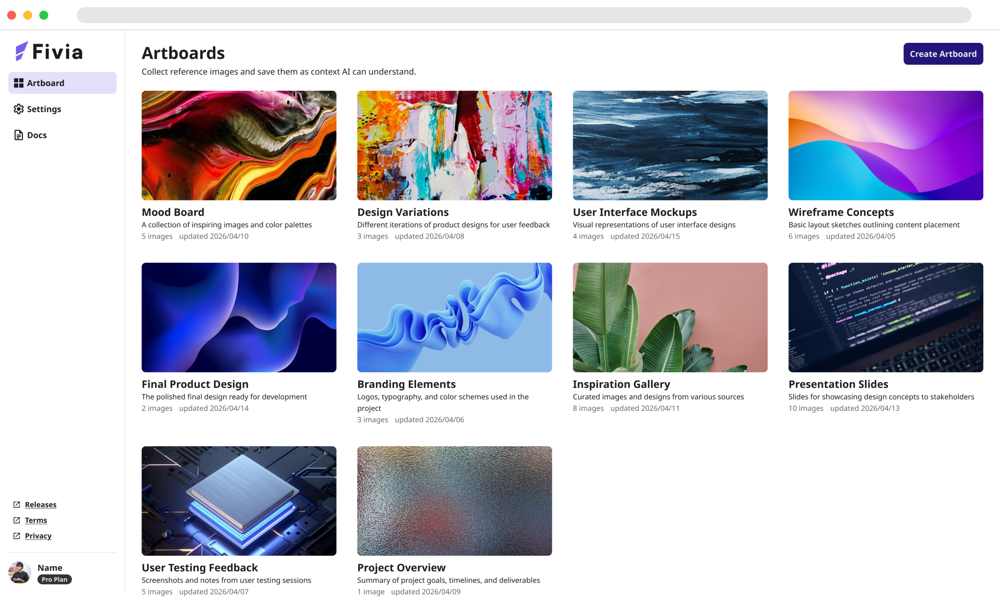
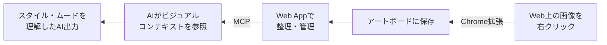
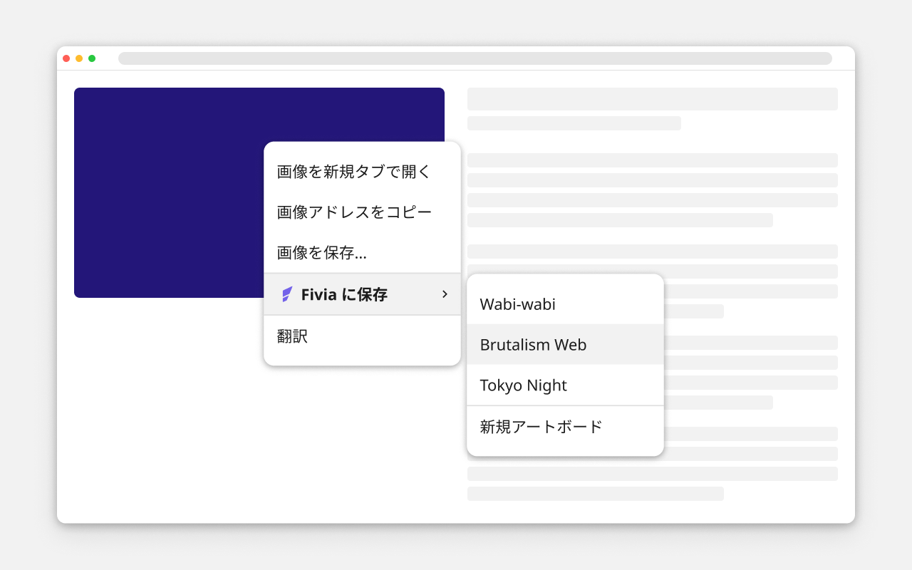

## 作品概要

**Fivia（フィビア）** は、 **「AIに渡すビジュアルコンテキストを管理する」** ツールです。

AI画像生成やデザイン指示において、「このスタイルで」という感覚をテキストだけで伝えることには限界があります。
Fiviaでは、Web上の画像をChrome拡張でアートボードに整理し、 **MCP（Model Context Protocol）経由でAIにビジュアルコンテキストを渡す** ことで、言語化しにくいスタイル・ムード・質感をAIに共有できます。

名前の由来は **`Figment`（想像・イメージの断片）** と **`via`（経由して渡す）** の造語で、ユーザーが集めたビジュアルの断片をAIに届けるというコンセプトを込めています。

また、個人で新しいプロダクトをゼロから作りたいというモチベーションと、AIを活用すれば一人でもフルスタックな開発ができるのではという仮説を試したかった。
設計・実装・リリースのすべてをAIと協働しながら進め、Chrome拡張・Webサービス・MCPサーバーという3つのコンポーネントを一人で完成させることができた。

### 補足情報

* 担当：個人開発（設計・実装・リリースまで一人）
* Web App：https://fivia.dev
* Chrome拡張：[Chrome Web Store](https://chromewebstore.google.com/detail/fivia/fnjmhopagijlipindphkadhpagbddpmj)
* MCPサーバー：https://fivia.dev/api/mcp

## Fivia



### 課題

AIを使ったデザイン生成や画像生成において、「このスタイルで作って」という曖昧な指示をテキストのみで伝えることは難しく、意図が伝わらないまま試行錯誤に時間がかかるという課題があります。参考画像をAIに渡す方法はあるものの、その都度ファイルを用意してアップロードする手間が発生し、複数の画像を一括で整理・管理する仕組みがありません。

Fiviaはこの課題に対して、 **「Web上の画像を集めてアートボードとして整理し、MCPで自動的にAIに渡す」** というアプローチで解決します。

### 使い方



### プロダクト構成

Fiviaは以下の3つのコンポーネントで構成されています。

#### ⚪︎ Chrome拡張


https://chromewebstore.google.com/detail/fivia/fnjmhopagijlipindphkadhpagbddpmj

Web上の画像を右クリックするだけでFiviaのアートボードに保存できます。ログイン状態に応じてコンテキストメニューが切り替わり、ログイン済みの場合はアートボードへの直接保存・新規アートボード作成・同期・ログアウトが行えます。

MV3 Service Workerの制約をふまえ、以下の設計上の判断を行いました。

- **Supabase SDKを使わないAPI設計**
  - MV3 Service WorkerではSupabase SDKが動作しないため、SupabaseへはWeb App API（`/api/me/...`）をfetchで呼び出す設計にし、プラン制限をサーバー側で確実に適用しています。
- **認証・セッション管理**
  - `chrome.identity.launchWebAuthFlow` でGoogle OAuth + PKCEフローを起動し、セッション（`access_token` / `refresh_token`）を `chrome.storage.local` に保存します。
  - 有効期限切れ前（残り5分）に自動リフレッシュし、401受信時はセッションをクリアしてログイン前の状態に戻します。
- **アートボードキャッシュ**
  - アートボード一覧を `chrome.storage.local` にキャッシュし、ログイン時・ポップアップ表示時・同期操作時に更新します。
- **フィードバックとi18n**
  - 画像保存の結果をバッジ（✓ / ✗）で30秒表示し、日本語・英語のi18n対応も実装しています。


#### ⚪︎ Web App

https://fivia.dev/

アートボードの作成・管理・詳細閲覧を行うWebサービスです。
Google OAuthによるログインに加え、Claude CodeなどのMCPクライアントがOAuth 2.0 + PKCEで接続できるリモートMCPエンドポイントを提供しています。
日本語・英語のi18n対応も実装しています。

- **マルチクライアント認証**
  - ブラウザはCookie（Supabase自動管理）、Chrome拡張はSupabase JWTのBearerトークン、MCPはPAT（Personal Access Token）と、クライアントごとに認証方式が異なります。`getUserId()` ヘルパーで3つを順に試し、最初に成功したものを採用する設計にしています。
- **OAuth 2.0 + PKCEによるMCP認証** 
  - MCPクライアントがOAuth Discoveryで認可サーバー情報を取得し、ブラウザログイン後にSupabaseのaccess token / refresh tokenを受け取るため、ユーザーがトークンをコピーして設定する必要がありません。
  - 認可コードやstateはAES-256-GCMで暗号化し、PKCEの `code_verifier` を検証してからトークンを発行する設計にしています。
- **レンダリング戦略の使い分け**
  - 公開ページ（ドキュメント・利用規約など）はSSGで事前生成、認証ページはSSR、アプリページはサーバーコンポーネント + Suspenseストリーミングを採用しています。
  - アプリページではページシェル（ヘッダー・タイトル・ボタン）を即時表示し、データ取得が必要な部分だけ非同期コンポーネントに分離してスケルトン表示するアーキテクチャです。
- **i18n戦略（URLプレフィックスなし）**
  - next-intlで日本語・英語に対応し、URLにロケールプレフィックスを含めない（`localePrefix: "never"`）設計にしています。日本語はSSGで事前生成、英語はSSRでオンデマンドレンダリングし、ロケール選択はクッキーとDBの `profiles.locale` で二重管理しています。


#### ⚪︎ MCPサーバー（リモートMCP）

Claude CodeなどのMCPクライアントからFiviaのアートボードを参照できるリモートMCPサーバーです。Next.jsの `/api/mcp` エンドポイントとしてStreamable HTTP transportで提供しています。提供するツールは `list_artboards` と `get_artboard` の2つです。

技術スタック: Next.js Route Handler / TypeScript / @modelcontextprotocol/sdk / Streamable HTTP

```json
{
  "mcpServers": {
    "fivia": {
      "type": "http",
      "url": "https://fivia.dev/api/mcp"
    }
  }
}
```

初回接続時にブラウザでFiviaへログインすると認証が完了し、以降はMCPクライアント側がリフレッシュトークンを使って再認証します。

- **base64配信**
  - `get_artboard` では画像URLだけでなく、base64データも返します。
  - AIサービスによっては画像入力にbase64が必須なケースがあるため、MCPサーバー側で画像を取得・変換してAIに渡せるよう設計しています。
- **部分的失敗への対応**
  - 保存済み画像のURLが削除・移動・アクセス不能になっても、ツール全体を失敗にしません。
  - 取得できた画像だけをコンテンツとして返し、取得できなかった画像はメタ情報内で `status: "failed"` として識別できるよう設計しています。
- **説明文をAIコンテキストとして活用**
  - `get_artboard` はアートボードの `name` と `description` も一緒に渡します。
  - description にスタイル・ムード・質感・避けたい方向性を書いておくことで、AIが画像群の意図を読み取りやすくなる設計です。

