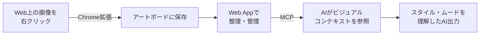

## 作品概要

**Fivia（フィビア）** は、 **「AIに渡すビジュアルコンテキストを管理する」** ツールです。

AI画像生成やデザイン指示において、「このスタイルで」という感覚をテキストだけで伝えることには限界があります。
Fiviaでは、Web上の画像をChrome拡張でアートボードに整理し、 **MCP（Model Context Protocol）経由でAIにビジュアルコンテキストを渡す** ことで、言語化しにくいスタイル・ムード・質感をAIに共有できます。

名前の由来は **`Figment`（想像・イメージの断片）** と **`via`（経由して渡す）** の造語で、ユーザーが集めたビジュアルの断片をAIに届けるというコンセプトを込めています。


### 補足情報

* 担当：個人開発（設計・実装・リリースまで一人）
* Web App：https://fivia.dev
* Chrome拡張：[Chrome Web Store](https://chromewebstore.google.com/detail/fivia/fnjmhopagijlipindphkadhpagbddpmj?hl=ja&utm_source=ext_sidebar)（バージョン 0.0.2）
* MCPサーバー：[npm `@fivia/mcp`](https://www.npmjs.com/package/@fivia/mcp)

## Fivia


### 開発の経緯

個人で新しいプロダクトをゼロから作りたいというモチベーションと、AIを活用すれば一人でもフルスタックな開発ができるのではという仮説を試したかった。

設計・実装・リリースのすべてをAIと協働しながら進め、Chrome拡張・Webサービス・MCPサーバーという3つのコンポーネントを一人で完成させることができた。

### 解決する課題

AIを使ったデザイン生成や画像生成において、「このスタイルで作って」という曖昧な指示をテキストのみで伝えることは難しく、意図が伝わらないまま試行錯誤に時間がかかるという課題があります。

参考画像をAIに渡す方法はあるものの、その都度ファイルを用意してアップロードする手間が発生し、複数の画像を一括で整理・管理する仕組みがありません。

Fiviaはこの課題に対して、 **「Web上の画像を集めてアートボードとして整理し、MCPで自動的にAIに渡す」** というアプローチで解決します。

### 使い方の流れ





### プロダクト構成

Fiviaは以下の3つのコンポーネントで構成されています。

#### Chrome拡張

Web上の画像を右クリックするだけでFiviaのアートボードに保存できます。コンテキストメニューから保存先のアートボードを選択でき、新規アートボードの作成もその場で行えます。

技術スタック: TypeScript / React 19 / esbuild / Chrome Manifest V3

#### Web App

アートボードの作成・管理・詳細閲覧を行うWebサービスです。Google OAuthによるログインと、MCPサーバー用のPersonal Access Token（PAT）発行機能を備えています。

技術スタック: Next.js 16 / React 19 / Tailwind CSS v4 / Supabase / Vercel

#### MCPサーバー（`@fivia/mcp`）

Claude CodeなどのMCPクライアントからFiviaのアートボードを参照できるMCPサーバーです。`list_artboards` でアートボード一覧を取得し、`get_artboard` で画像のメタ情報とbase64データをAIに渡します。

技術スタック: Node.js / TypeScript / @modelcontextprotocol/sdk

```json
{
  "mcpServers": {
    "fivia": {
      "command": "npx",
      "args": ["-y", "@fivia/mcp"]
    }
  }
}
```

### 技術設計の工夫

#### PAT（Personal Access Token）認証

MCPサーバーからのAPIアクセスには、JWTではなくPATを採用しました。MCPサーバーはユーザーのローカルマシンで実行され、長期間認証を維持する必要があるため、Supabase AuthのJWT（有効期限あり）ではなくPATが適しています。トークン値はDBにハッシュで保存し、作成時のみ平文を表示する設計にしています。

#### 画像のbase64配信

`get_artboard` では画像URLだけでなく、base64データも返します。AIサービスによっては画像入力にbase64が必須なケースがあるため、MCPサーバー側で画像を取得・変換してAIに渡せるよう設計しています。

#### Monorepo構成

Web App・Chrome拡張・MCPサーバーを1つのmonorepoで管理しています。Web APIの仕様変更が複数コンポーネントに影響するため、同じPRで横断的に変更できる体制を整えています。共通の型定義やブランドアセットは `packages/shared` に集約しています。

### リリース状況

| コンポーネント | 状態 |
| --- | --- |
| Web App | Vercelで本番運用中（https://fivia.dev） |
| Chrome拡張 | Chrome Web Store公開済み（v0.0.2） |
| MCPサーバー | npm公開済み（`@fivia/mcp` v0.1.1） |
