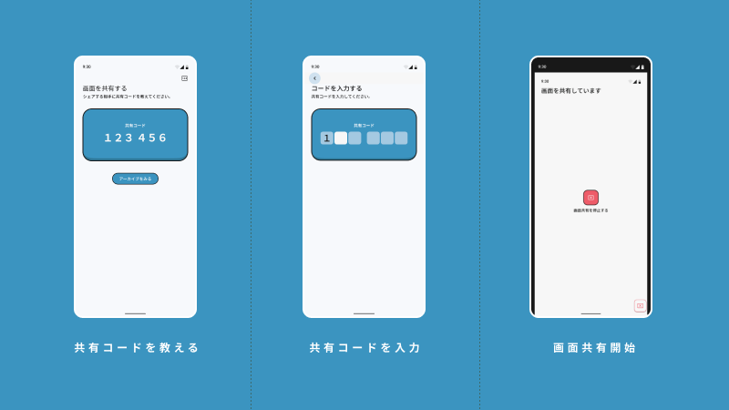

## 作品概要

**michibiki** は、 **「スマホの操作に困っている家族や知人を、遠隔から“視覚的に”サポートできる」** ことを目的としたスマホ遠隔操作補助アプリです。

スマホは非常に普及している一方で、設定変更やエラー対応など、なにか問題が起きたときに自力で解決できない人も多くいます。
その結果、家族や詳しい知人が電話やメッセージで支援する場面が増えていますが、 **言葉だけで状況を共有し、正しい操作を伝えることには限界** があります。

michibiki では、 **画面共有** と **オーバーレイによる操作指示（視覚的なガイド）** によって、
「いまどこを見ていて、次にどこを押せばいいのか」を直感的に伝えられる体験を設計しました。

本作品は、単なるリモート支援ツールではなく、 **“教える側”と“教わる側”のもどかしさを減らし、家族みんなでデジタルを使える状態をつくる** ことに挑戦したプロジェクトです。

### 補足情報

* チーム名：Volare Tokyo
* 担当：デザイナー（UI設計 / インタラクション / アニメーション）
* Hack Day 2022：https://hackday.yahoo.co.jp/
* [【ハッカソン】Hack Day 2022で普段やらないことに挑戦した話。 - Qiita](https://qiita.com/degudegu2510/items/79bad6fd9bde5a06984f)

## michibiki
### 課題設定とテーマ解釈

ITに詳しい人ほど、家族や知人から「スマホの使い方を教えてほしい」と頼まれる機会が多くあります。
しかし、実際のサポートは多くの場合、

* 電話で状況を聞き出す
* スクリーンショットを送ってもらう
* “たぶんこの画面だよね”と推測しながら案内する

といった形になり、 **お互いにストレスがかかりやすい** という課題があります。

この課題の本質は、操作手順そのものよりも、
**「同じ画面を見られていない」ことによる認識のズレ** にあります。
特にスマホ操作に不慣れな人ほど、画面遷移や用語理解にハードルがあり、言葉だけでの案内が難しくなります。

そこで本作品では、コンセプトを **「家族みんなでデジタルを」** と置き、
“教える側”が一方的に説明するのではなく、 **視覚的に同じ体験を共有しながら導ける** サポート体験を目指しました。

### 体験設計・UI設計

michibiki の体験設計では、 **「スマホが苦手な人でも、迷わずサポートを開始できること」** と、
**「教える側が“ここ”を示せること」** を最優先に設計しました。

#### 体験設計

本作品では、サポートを受ける側の負担をできるだけ小さくするため、
**複雑な設定や事前準備を要求しない導入体験** を重視しています。

体験は以下の流れを基本に設計しました。

1. サポートを受ける側が共有を開始し、共有コードを発行する
2. サポートする側がコードを入力して接続する
3. 画面を共有しながら、オーバーレイで“押す場所”を視覚的に指示する

「説明して伝える」から「見せて導く」へ。
会話が噛み合わない原因を、体験設計で解消することを狙っています。

#### UI設計

UI設計では、 **迷いを生む要素を徹底的に減らす** ことを意識しました。

* サポートを受ける側は「開始 → コードを伝える」だけで進められる導線にする  
* 教える側は、操作指示に集中できるよう機能を絞り、視線移動を最小化する  
* 指示の伝達はテキストではなく、**オーバーレイのマーカー** で直感的に示せるようにする  

また、接続待ちや同意が必要な場面では、**不安を減らすためのアニメーション/インタラクション** を取り入れ、
“何が起きているのか分からない時間”をできるだけ作らないことを意識しています。
