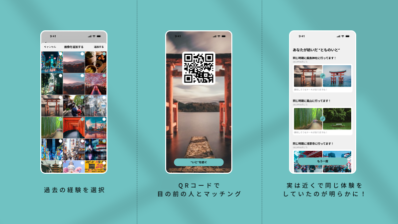

---
title: TOMONOITO
thumbnail: ./img/image-ogp.png
--- 

## 作品概要

**TOMONOITO** は、 **「まだ深く知らない相手との間に、“共通の記憶”を見つけることで距離を縮める」** ことを目的としたモバイルアプリです。

初対面や関係性が浅い場面では、会話のきっかけが見つからず、表面的なやり取りに留まってしまうことが多くあります。
TOMONOITO では、ユーザーが過去に撮影した写真をもとに、 **「同じ時期・近い場所にいた」という事実＝共通の体験** を自動で発見し、
それを会話や関係性が深まる“きっかけ”として提示する体験を設計しました。

本作品は、単なるマッチングや検索ではなく、
**人と人との間に“語りたくなる記憶”を生み出す体験をどうデザインできるか**
に挑戦したプロジェクトです。

### 補足情報

* チーム名：知り合いの知り合い
* 担当：デザイナー（体験設計 / UI設計 / 演出設計）
* SPAJAM：https://history.spajam.jp/2023/result/

## TOMONOITO
### 課題設定とテーマ解釈

初対面や関係性が浅い相手とのコミュニケーションでは、
「何を話せばいいかわからない」「当たり障りのない会話で終わってしまう」といった状況が頻繁に起こります。

多くの場合、こうした場面では、自己紹介や共通の話題を自分から探しにいくことが求められますが、
それ自体が心理的なハードルになり、会話が広がらない原因にもなっています。

そこで本作品では、「共通点を探す」のではなく、「共通点が自然に見つかる」体験に着目しました。

人は、

* 実は同じ時期に
* 実は近い場所で
* 実は似た体験をしていた

という事実を知った瞬間、相手との距離を一気に近く感じることがあります。

この「偶然の一致」は、作られた話題よりも強く記憶に残り、
その後の会話を自然に生み出す力を持っています。

TOMONOITO では、ユーザーが過去に撮影した写真に含まれる
撮影日時・位置情報といった記録を手がかりに、「まだ知り合っていなかった頃の共通体験」を可視化することで、
会話や関係性が深まるきっかけを提供できるのではないかと考えました。

ハッカソンのテーマに対しても、単なるマッチングや交流促進として解釈するのではなく、
「人と人との関係が深まる瞬間は、どんなときに生まれるのか」という視点から再解釈し、
その瞬間を体験としてデザインすることを目指しています。

### 体験設計・UI設計

TOMONOITO の体験設計では、**「共通点を知った瞬間に、相手との距離が一気に縮まる感覚」** を
いかに自然に、そして印象深く生み出せるかを重視しました。

#### 体験設計
本作品では、ユーザーに何かを“探させる”のではなく、
体験の流れに身を委ねるだけで、共通点が立ち上がる構造を目指しています。

そのため、体験は以下のようなシンプルな流れに設計しました。

1. 過去に撮影した写真を選ぶ
2. 目の前にいる相手と、QRコードで即座につながる
3. 実は近い時期・近い場所にいたという事実が明らかになる

#### UI設計

UI設計では、情報を多く見せることよりも、“発見の瞬間”を邪魔しないことを最優先しました。

画面構成は極力シンプルにし、視線が迷わないレイアウトにする
詳細な数値や位置情報は前面に出さず、「近い」「同じ頃」といった感覚的な表現を重視

結果表示時には、アニメーションを用い、共通点が見つかった際の高揚感を視覚的に補強する

また、QRコードによる接続を採用することで、
**「この場にいる相手と、今この瞬間につながっている」**という
場の一体感を生み出すことを意図しています。

